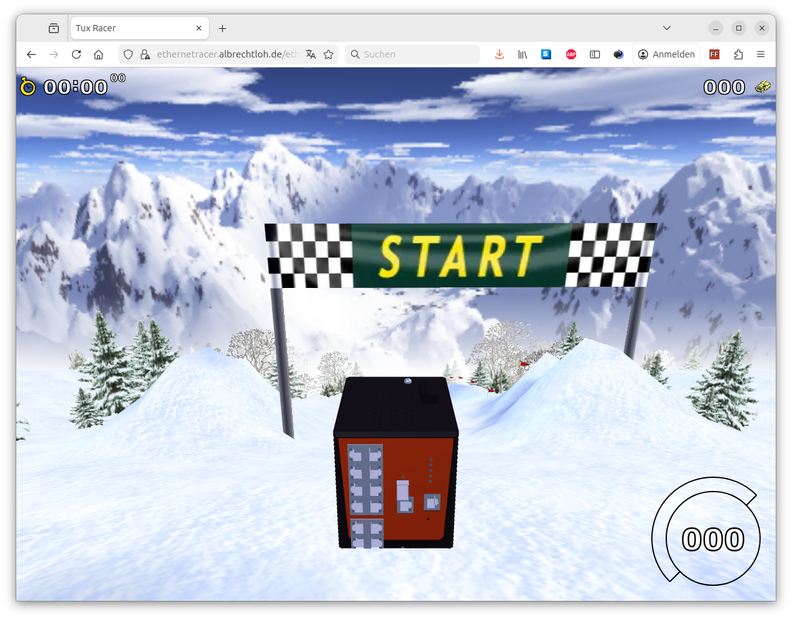
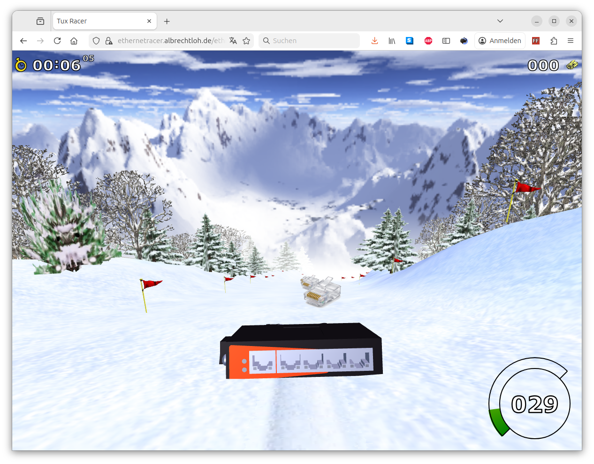

# EthernetRacer

Ethernet Racer is a clone of [TuxRacer](https://github.com/ebbejan/tux-racer-js) to try out agent-based programming. 
[Play EthernetRacer online](http://ethernetracer.albrechtloh.de/)




It is a port / rewrite of *Extreme Tux Racer*, which itself is based on the original *Tux Racer* game. This project allows you to enjoy switch Racer directly in your web browser, supporting all major desktop and mobile browsers.

**Note:** This project is in an early development stage and far from complete. However, some courses are already functional enough to provide a fun experience (at least for me!).

---

## How to Run EthernetRacer

### Prerequisites
- A recent version of Node.js (I'm using v22, but other versions may work as well)

### Steps
1. Clone or download the repository:
   ```sh
   git clone https://github.com/AlbrechtL/ethernet-racer-js
   cd ethernet-racer-js
   ```
2. Install dependencies:
   ```sh
   npm install
   ```
3. Start the development server:
   ```sh
   npm run dev
   ```
4. Open the URL provided in the terminal output in your web browser.
5. Enjoy!

---

## How to Play

### Controls
- **Desktop:** Use either the keyboard (WASD or arrow keys) or the mouse to control switch.
- **Mobile:** Control switch using touch input via a virtual joystick.

### Tips
- **Paddling forward** helps switch gain initial speed but is slowing down once he reaches high velocity.
- **Braking** is useful for mastering tight turns.
- **Terrain types** significantly impact switch's acceleration and handling.

### Selecting a Course
By default, the game starts on *Bunny Hill*, but you can switch to a different course using the `course` URL query parameter.

To play a specific course, add `?course=course-name` to the URL. For example:
```
http://localhost:5173/?course=frozen-river
```
Below is a list of available courses and their corresponding parameters:

| Course Name  | URL Parameter |
| ------------ | ------------- |
| Bunny Hill (default) | bunny-hill  |
| Frozen River | frozen-river  |
| Challenge One | challenge-one  |
| Chinese Wall | chinese-wall  |
| Downhill Fear | downhill-fear  |
| Explore Mountains | explore-mountains  |
| Frozen Lakes | frozen-lakes  |
| Hippo Run | hippo-run  |
| Holy Grail | holy-grail  |
| In Search of Vodka | in-search-of-vodka  |
| Milos Castle | milos-castle  |
| Path of Daggers | path-of-daggers  |
| Penguins Can't Fly | penguins-cant-fly  |
| Quiet River | quiet-river  |
| Secret Valleys | secret-valleys  |
| This Means Something | this-means-something  |
| switch at Home | switch-at-home  |
| Twisty Slope | twisty-slope  |
| Wild Mountains | wild-mountains  |
| Bumpy Ride | bumpy-ride  |

### Changing the Environment
The game also supports different environments, which can be selected using the `environment` URL query parameter.

To change the environment, add `?environment=environment-name` to the URL. For example:
```
http://localhost:5173/?environment=night
```
Here are the available environments:

| Environment | URL Parameter |
| ----------- | ------------- |
| Sunny (default) | sunny  |
| Night | night  |
| Cloudy | cloudy  |

You can also combine parameters, for example:
```
http://localhost:5173/?course=downhill-fear&environment=night
```
This would start the game on *Downhill Fear* with a *Night* environment.

### Replacing the Switch Model at Runtime
The root switch model can be replaced at runtime by passing a remote mesh URL as a query parameter. This keeps third-party geometry out of the repository.

Supported formats:
- `OBJ`
- `STEP` / `STP`

Available query parameters:

| Parameter | Description | Example |
| --------- | ----------- | ------- |
| `switchMeshUrl` | URL of the remote mesh file to load at runtime. | `https://example.com/model.obj` |
| `switchMeshScale` | Per-axis scale as `x,y,z`. | `1.25,1.25,1.25` |
| `switchMeshRotation` | Per-axis rotation in degrees as `x,y,z`. | `0,180,0` |
| `switchMeshTranslation` | Per-axis translation as `x,y,z`. | `0,0,0` |
| `switchMeshDiffuseColor` | Optional RGB override as `r,g,b` in the range `0..1`. If omitted, imported mesh colors are used when available. | `1,0.5,0` |
| `switchMeshSpecularColor` | Optional RGB specular override as `r,g,b` in the range `0..1`. | `0.9,0.8,0.4` |
| `switchMeshSpecularExponent` | Optional specular exponent override. | `22` |

Example using the Weidmuller STEP model:
```
http://localhost:5173/?course=tux-at-home&switchMeshUrl=https://assets.dam.weidmueller.com/assets/api/615058a2-353d-4143-a44b-60341df3cf1b/original/2682130000.stp&switchMeshScale=1.5,1.5,1.5&switchMeshRotation=180,90,90&switchMeshTranslation=0,0,0
```

Notes:
- The remote server must allow cross-origin requests. If the mesh URL does not provide CORS headers, the game falls back to the built-in switch model.
- STEP support uses a browser-side WASM importer, so initial loading is heavier than OBJ.

---

## Contributing
Contributions are welcome! Feel free to submit issues, feature requests, or pull requests.

---

## Credits

### Original *Extreme Tux Racer* Team
- Steven Bell
- Kristian Picon
- Nicosmos
- R. Niehoff
- Philipp Kloke
- Marko Lindqvist

### Original *Tux Racer* Authors
- Eric Hall
- Jasmin Patry
- Mark Riddell
- Patrick Gilhuly
- Rick Knowles
- Vincent Ma

### Music
- Grady O'Connell
- Kristian Picon
- Karl Schroeder
- Joseph Toscano

### Graphics
- Nicosmos
- Kristian Picon
- Daniel Poeira

### TuxRacer.js Development
- Developed by Jan Ebbe

---

## License
EthernetRacer is licensed under the **GNU General Public License v2.0**. For the complete license text, see the file [`LICENSE`](LICENSE).

